# codex-resume-after-wait

[](https://github.com/zycccishere/codex-resume-after-wait/actions/workflows/smoke.yml)
[](LICENSE)

> Waiting for a process to exit is easy. Waking the **right durable Codex task**—across forks,
> crashes, PID reuse, active turns, idle turns, Terminal, Desktop, and Remote Control—without
> replaying an ambiguous write is a small distributed-systems protocol.

Protocol v3 hands a long process wait to a detached watcher, then publishes one owner-bound
continuation event. It prefers native injection into the exact app-server authority that already
owns the task; when that cannot be proven, it leaves an explicit marker instead of guessing.

It does **not** use goals, `codex exec resume`, or `thread/resume` for delivery. It does not claim
strict exactly-once execution. Its central guarantee is narrower and more useful: after a request
may have crossed the delivery boundary, the event is never automatically replayed.

## The protocol in one picture

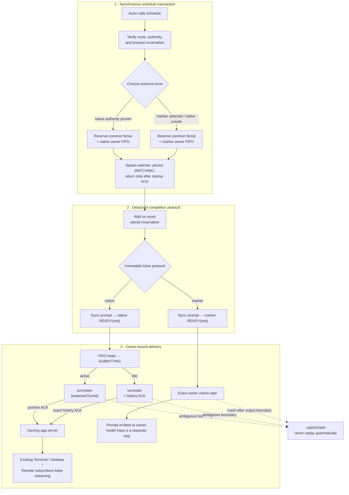

The native/marker split is permanent once the ticket is reserved. A native delivery never falls
back to marker after opening a request boundary.

Five identities are deliberately kept separate:

| Identity | What it names | Why it cannot be substituted |
| --- | --- | --- |
| Process incarnation | One concrete lifetime, not merely a PID | PIDs are reusable namespace slots |
| `actor_thread_id` | The task executing `schedule` | A subagent may act without owning delivery |
| `owner_thread_id` | The durable branch that receives the continuation | A matching history ID in another app-server is not the same owner authority |
| `job_scope_id` | The earliest verified ordinary-fork lineage origin | Sibling forks must share one duplicate-job fence |
| App-server authority | The live server instance already holding the owner | A thread ID names history; it does not name execution authority |

## Install

```text
$skill-installer install https://github.com/zycccishere/codex-resume-after-wait/tree/main/skills/blocking-wait-handoff
```

Restart Codex after installation so the skill is rediscovered.

## Quick start

Inspect routing and attachment before scheduling:

```bash
python3 skills/blocking-wait-handoff/scripts/codex_wait_handoff.py active \
  --include-stale --json

python3 skills/blocking-wait-handoff/scripts/codex_wait_handoff.py doctor --json
```

Schedule an already-running local PID:

```bash
python3 skills/blocking-wait-handoff/scripts/codex_wait_handoff.py schedule \
  --blocking \
  --expected-seconds 1800 \
  --pid 12345 \
  --note "Inspect the outputs and continue the blocked task."
```

Read the result before ending the current turn. The fields that explain the protocol decision are:

- `actor_thread_id`, `owner_thread_id`, `owner_route`, and `job_scope_id`;
- `logical_job_id`, `job_key`, `task_id`, `event_id`, and `client_user_message_id`;
- `resume_protocol`, `delivery_branch`, `authority`, `authority_strength`, and `fifo_generation`;
- `will_wake_idle_thread`, `native_at_most_once`, and `strict_exactly_once`.

Only `resume_protocol=native-message` can wake an idle task. `marker` requires a later owner-side
claim and input.

## Control-flow classification

The classifier is intentionally boring: `schedule` and `doctor` call the same pure decision
function and expose the same stable `delivery_branch`. There is no cold-load fallback, no
second-owner fallback, and no native-to-marker fallback after a request begins.

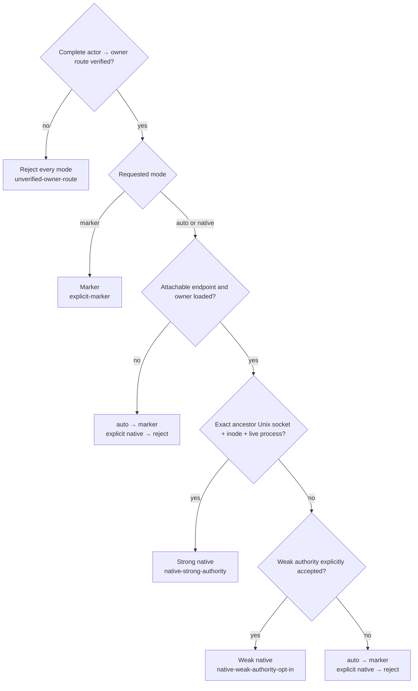

| Verified actor route | Owner authority at scheduling | `auto` | Explicit `native-message` |
| --- | --- | --- | --- |
| No | Any | Reject | Reject |
| Yes | Private stdio or Embedded; no attachable endpoint | Marker | Reject |
| Yes | Attachable, but owner is not positively loaded | Marker | Reject |
| Yes | Loaded behind exact ancestor Unix listener + inode + live process | Strong native | Strong native |
| Yes | Loaded behind WS/WSS, alias, or non-ancestor endpoint | Marker | Reject unless `--allow-weak-authority`; then weak native |

Explicit `marker` bypasses authority probing, but never actor-route verification. Private stdio and
Embedded remain non-attachable even with weak opt-in.

### Actor, owner, and fork scope

An actor can be different from both the delivery owner and the duplicate-job scope:

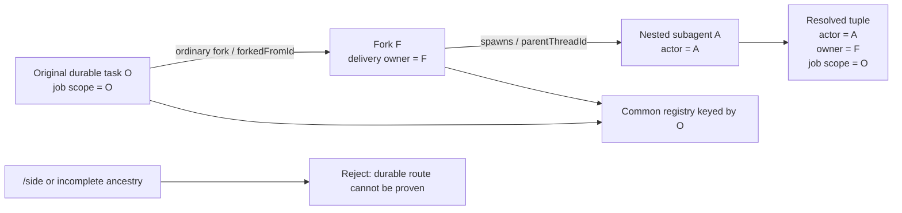

| Caller | Delivery owner | Common job scope | Policy |
| --- | --- | --- | --- |
| Durable top-level task | Itself | Itself | Accepted |
| Ordinary fork | That fork | Earliest verified fork origin | Accepted; first sibling reservation wins the same job |
| Nested subagent | Verified durable agent-tree root | That root's earliest fork origin | Accepted as actor; direct child resume-self is rejected |
| `/side`, cyclic, partial, or missing ancestry | Unknown | Unknown | Reject both native and marker |

A wait scheduled before a later fork remains bound to the original branch. Forking history never
migrates an existing reservation.

## Scheduling is a guarded handoff, not “spawn and hope”

The parent does not report success immediately after starting a background process. It waits until
the child proves that watcher ownership is already durable.

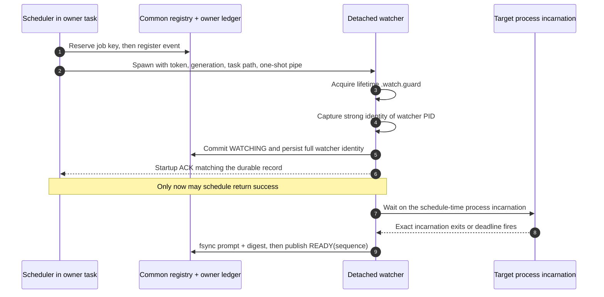

The startup ACK must match task ID, reservation token, protocol generation, watcher PID, complete
watcher process identity, and `phase=watching`. `reserving` and `scheduled` are externally
non-cancellable handoff phases, closing the scheduler/cancel collision window.

## Process-incarnation fencing

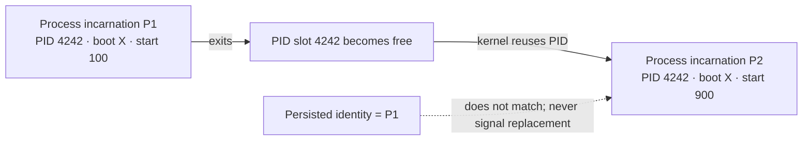

A PID is only a reusable slot. Before preflight and again before detaching, v3 captures the exact
process incarnation and persists it. Polling and `--also-stop-target` use only that stored identity;
a pattern is never rerun later to discover new targets.

| Target host | Strong start identity | Exit wait | Strict scheduling |
| --- | --- | --- | --- |
| Local Linux | Boot ID + `/proc/<pid>/stat` start ticks | `pidfd` when available, otherwise polling | Yes |
| Remote Linux | Remote boot ID + `/proc` start ticks | Polling over SSH | Yes |
| Local macOS | Microsecond start time from `libproc` | `kqueue NOTE_EXIT` when available, otherwise polling | Yes |
| Remote macOS or generic Unix | Second-resolution `ps lstart` only | Polling | Rejected as too weak |

`--pattern` snapshots every matching non-zombie incarnation after excluding the helper and its
ancestor chain. The remote pattern travels over helper stdin, not an SSH or shell argv that
`pgrep -f` could match. If several processes match, the watcher waits only for that immutable set;
later matches are outside the job.

Linux local termination uses a pidfd when Python exposes both open and signal operations. macOS,
remote shells, and fallback Linux can only revalidate immediately before `kill`, leaving the
unavoidable POSIX check-to-signal window. Inspection uncertainty always fails closed, and every
already-detected PID replacement is left untouched.

The logical duplicate key is derived from identity rather than discovery syntax:

```text
job_key = hash(
  job_scope_id,
  logical_job_id,
  sorted immutable process incarnations
)
```

Finding the same live incarnation by PID or pattern produces the same default job key. A reused
PID produces a different one.

## The queue: completion order, not scheduling order

Every owner/protocol ledger assigns `ready_sequence` only when an event becomes `READY`. A job
scheduled first but completed last belongs later in the queue.

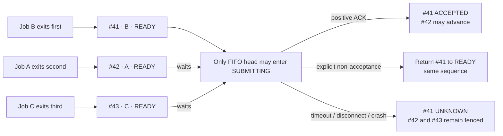

A later watcher may help dispatch an earlier abandoned `READY` entry, but only after acquiring that
earlier task's lifetime guard. It cannot pass a live watcher, `SUBMITTING`, or `UNKNOWN` head.

### Protocol-ledger state machine

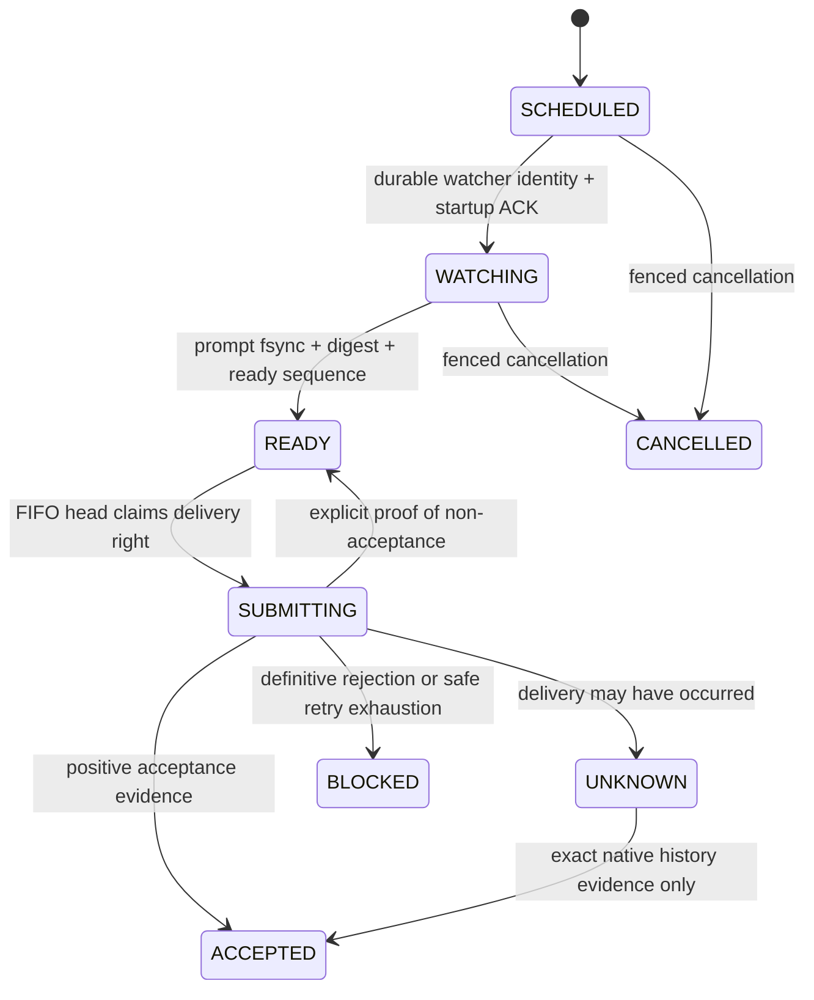

`UNKNOWN` is deliberately monotonic. It cannot return to `READY`, switch to marker, or be
cancelled. This sacrifices liveness to prevent duplicate delivery.

## ACK is not one thing

The protocol uses several acknowledgement boundaries. Conflating them is a common source of
incorrect “exactly once” claims.

| Evidence | Positive proof | It does **not** prove |
| --- | --- | --- |
| Watcher startup ACK | The detached watcher identity and `WATCHING` state were already persisted | Target completion or continuation delivery |
| `turn/steer` response | Input was accepted into the exact `expectedTurnId` | Model completion, tool success, or UI visibility |
| Idle persisted-history ACK | Exact `userMessage.clientId` exists in owner history after `turn/start` | Strict server-side idempotency or model completion |
| Marker flush + ledger commit | The owner-bound prompt was emitted to claimant stdout | That the prompt became Codex/model input |
| Remote Control sequence/ACK | First-party relay transport progressed | Acceptance of this continuation event |

The watcher intentionally does not treat stream notifications as delivery ACKs. A fresh secondary
connection is not automatically subscribed to an existing owner merely because it called
`thread/read`, `turn/start`, or `turn/steer`.

### Active and idle owners have different acceptance protocols

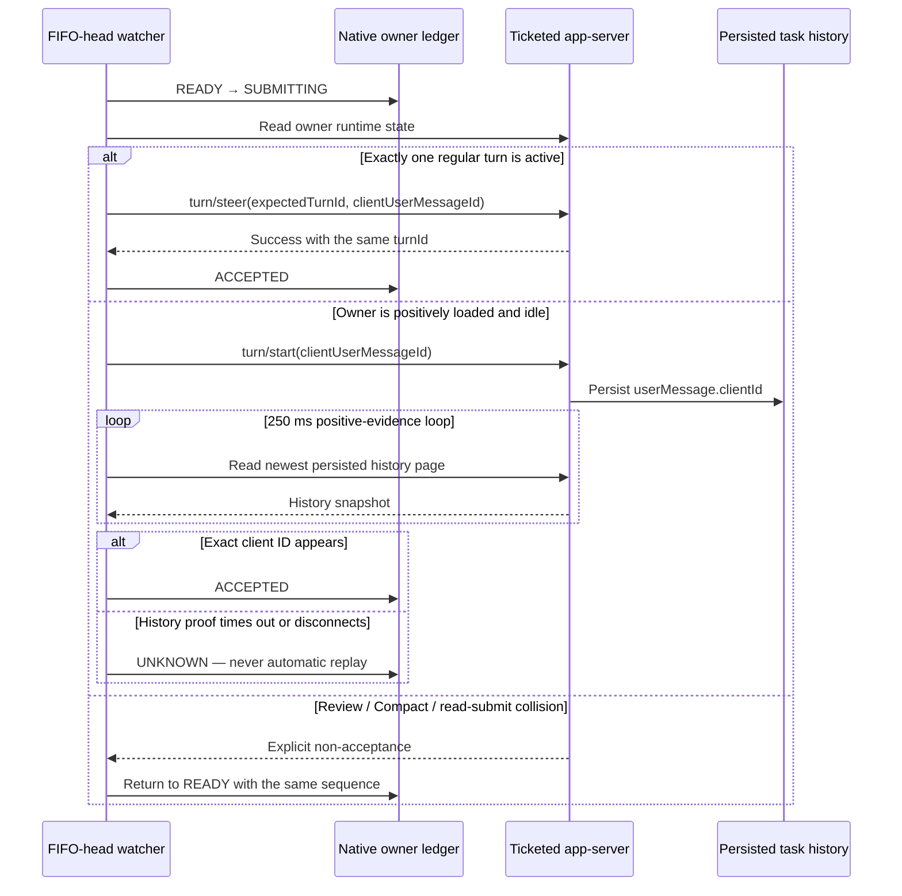

Review/Compact and read/submit collisions use a separate durable retry budget: 900 one-second
attempts by default. `--state-collision-max-attempts 0` means intentionally unlimited waiting.
Exhaustion is a definitive pre-submission `BLOCKED`, so a later deliberate schedule cannot
duplicate an accepted message.

Legacy history uses `thread/read(includeTurns=true)`. Paginated history uses
`thread/turns/list`: the live idle ACK loop needs only the newest full page, while manual
`UNKNOWN` reconciliation follows every cursor because an old ambiguous event may have aged out of
the newest page. Reads never call `thread/resume` and never cold-load a second authority.

### The retry line

> The protocol's most important decision is not how to retry. It is when retrying becomes illegal.

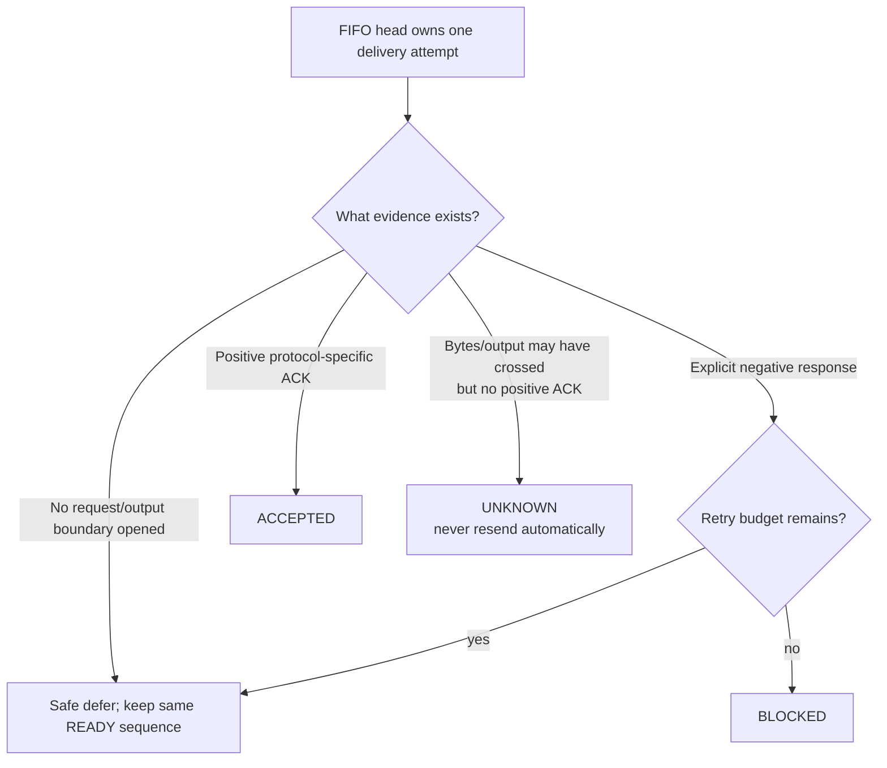

`clientUserMessageId` is correlation and positive history evidence; current public Codex APIs do
not document it as a server-side idempotency key. A missing response, dead dispatcher, or absence
from one history snapshot can never prove non-acceptance.

## Two delivery ledgers, one common fence

Native input and marker output cannot share a real queue, so pretending they have a global FIFO
would be dishonest. Protocol v3 keeps separate queues and forbids unsafe mixing.

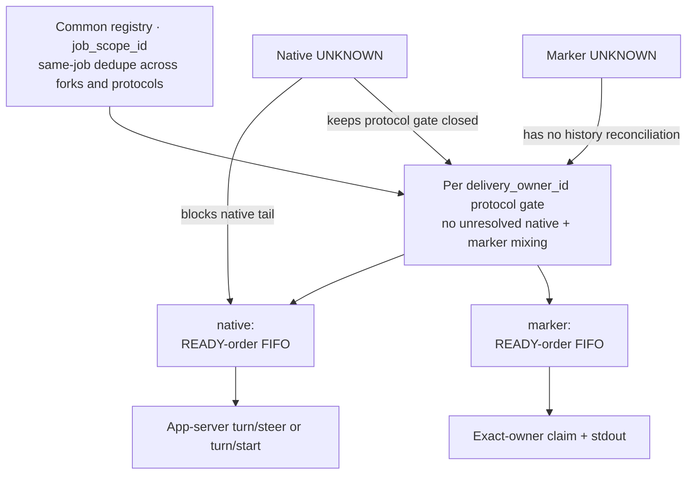

The common registry is keyed by `job_scope_id`, while each entry also records its exact
`delivery_owner_id`:

- `ACTIVE`, `UNKNOWN`, and `ACCEPTED` deduplicate the same job key;
- `ACCEPTED` is a permanent tombstone across sibling forks and both protocols;
- `BLOCKED` and `CANCELLED` release the job key for a later retry;
- different ordinary-fork owners have separate protocol gates, but still share same-job dedupe.

The two crash domains converge in one direction only:

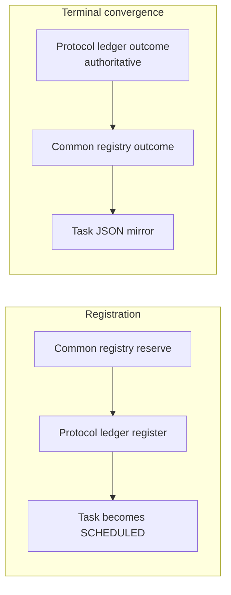

Exact token/generation identities make interrupted registration idempotently repairable. During
terminal repair, the common registry and task mirror may advance to the ledger's outcome; they may
never move a terminal or tombstone state backward.

## Native streaming: inject into the owner, then get out of the way

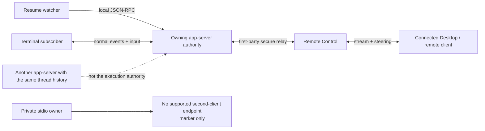

The watcher never reimplements Terminal ↔ Desktop streaming and never impersonates Desktop. It
injects into the ticketed app-server; that owner emits its normal `turn/*`, `item/*`, tool, and
delta events to first-party clients that are already connected and subscribed to the task.

The watcher also does not subscribe itself, so it does not steal UI or approval ownership. With no
subscriber, accepted work remains in persisted history, but no live display is promised and an
approval may wait until a first-party client later resumes and subscribes.

| Topology | Delivery | Live visibility |
| --- | --- | --- |
| Managed daemon through exact ancestor Unix listener | Strong native | Current first-party task subscribers receive the normal owner stream |
| Explicit/configured Unix endpoint without ancestor proof | Marker by default; weak native with explicit opt-in | Conditional on a connected, subscribed first-party client |
| Explicit remote WS/WSS or TLS alias | Marker by default; weak native with credential reference and opt-in; backend instance is not fenced | Conditional on a connected, subscribed first-party client |
| Desktop controlling a Terminal host | Desktop is a subscriber surface, not a distinct authority | Streams while Desktop is connected and task-subscribed |
| Desktop SSH project using remote Unix listener + `app-server proxy` | Strong native when the remote watcher proves that exact ancestor socket and process | Desktop receives the normal stream through its SSH proxy |
| Older/custom Desktop SSH topology with private stdio only | Marker only | No supported external attachment |
| Terminal Embedded | Marker only | No external endpoint |
| Local Desktop/IDE private stdio | Marker only | Private pipes are not a supported second-client endpoint |

Remote Control additionally requires the host to remain awake and online, the account signed in,
and the host app running. Public Remote Control installation/environment IDs are not a per-process
app-server nonce and do not upgrade WS/WSS into a strong authority.

### Known idle-start side effect

The public idle API is `turn/start`. In the audited Codex implementation it copies the calling
connection's app-server client info and form-elicitation capability into the loaded thread before
submitting input. The watcher identifies itself as the official secondary
`codex_app_server_daemon/2.0.0` client, but idle wake still replaces the prior thread client
name/version, sets OpenAI-form elicitation support to `false`, and may refresh MCP state.

The active `turn/steer` path does not perform that update. Current public APIs expose no neutral
idle-enqueue operation that preserves all owner client capabilities.

## Marker fallback

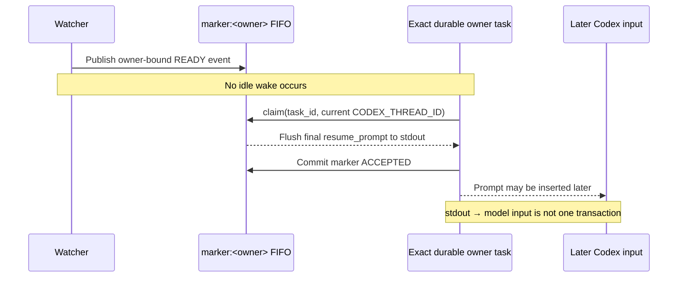

```bash
python3 skills/blocking-wait-handoff/scripts/codex_wait_handoff.py pending \
  --owner-thread-id "$CODEX_THREAD_ID" --json

python3 skills/blocking-wait-handoff/scripts/codex_wait_handoff.py claim \
  --task-id <task-id> \
  --owner-thread-id "$CODEX_THREAD_ID" --json
```

Claiming is branch-bound and single-consumer. The implementation flushes the prompt before
committing marker `ACCEPTED`; a crash in that gap becomes `UNKNOWN` and never replays. Even
`ACCEPTED` proves only that output was emitted, not that it became model input.

This repository does not implement a Desktop heartbeat. A separately configured first-party
automation may poll and claim for the exact owner, but periodic polling does not turn marker mode
into a native wake.

## Three races that define the protocol

| Race | Naive failure | Fence used by v3 |
| --- | --- | --- |
| Cancel vs possible submission | Cancellation releases a job after input may already be accepted | Commit `SUBMITTING` before the request/output boundary; cancellation is legal only before `READY` |
| Scheduler/cancel vs watcher startup | Parent returns or cancels while an unguarded child continues | Stable lifetime guard, persisted strong watcher identity, then exact startup ACK |
| Hidden watcher replay | Re-running `watch` observes completion and publishes a second event | `watch` enters only from `scheduled`/`watching`; every post-event phase is a hard rejection |

Cancellation and recovery follow the same monotonic rules:

- `cancel` and `stop` signal only the persisted watcher incarnation;
- missing, malformed, weak, permission-denied, or unprobeable identity retains the reservation;
- `stop --also-stop-target` touches the captured target only after ledger cancellation commits;
- recovery preserves the original absolute wait deadline and retry budgets;
- abandoned `SUBMITTING` becomes `UNKNOWN`, never `READY`;
- `event_staged` becomes `READY` only after prompt-digest verification;
- native `UNKNOWN -> ACCEPTED` requires the exact persisted client ID;
- marker `UNKNOWN` has no safe reconciliation path.

Use `recover --task-id ...` for a crashed staged/ready watcher and
`reconcile --task-id ...` only for native `UNKNOWN`. Absence from history is inconclusive.

## Authority handoff: epoch CAS, not state migration

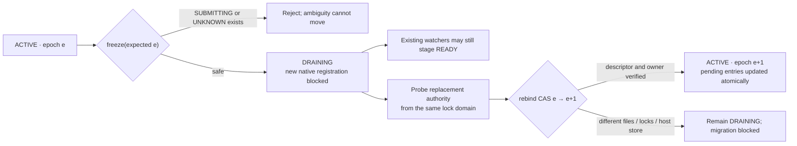

`freeze`/`rebind` changes the authority descriptor only within one unchanged coordination store.
Every watcher and command must keep using the same task files, ledgers, job registry, and stable
lock inodes. Equal path strings, copied files, or an independent mount are not equivalent. Never
copy or move live state as a migration protocol.

Rebind does not move watcher processes or credentials, retire the old app-server, integrate Codex
product handoff, or provide strict cross-host migration. The authority epoch is enforced by the
local ledger; current app-server message insertion has no matching server-side epoch precondition.

## Explicit remote authority

When the current shell descends from an attachable app-server listener, the script discovers that
exact ancestor endpoint. Otherwise the managed daemon socket under
`$CODEX_HOME/app-server-control/app-server-control.sock` is used only for persisted routing
diagnostics; it never becomes the owner of a private Desktop/IDE or Embedded task.

For a TUI using an explicit remote app-server, provide the same connect endpoint if discovery
cannot recover it reliably:

```bash
export CODEX_WAIT_REMOTE_TOKEN='<bearer token>'

python3 skills/blocking-wait-handoff/scripts/codex_wait_handoff.py schedule \
  --blocking \
  --expected-seconds 1800 \
  --pid 12345 \
  --app-server-endpoint 'wss://example.test:443/' \
  --app-server-auth-token-env CODEX_WAIT_REMOTE_TOKEN \
  --allow-weak-authority
```

Only the environment-variable name is persisted; keep the token variable available to the
detached watcher. The audited listener itself binds plain `ws://`; a TUI may use `wss://` through a
private TLS proxy. Because endpoint, TLS, installation ID, and environment ID can survive a
restart or backend change, every WS/WSS route remains weak. Prefer authenticated TLS on a private
network, VPN/mesh, or SSH tunnel, and never expose the app-server directly to the public Internet.

## Jobs, forks, and intentional repeat cycles

The default logical job ID is `process-lifetime`. For the same fork scope and process incarnation:

- the first ordinary branch whose common-registry reservation commits wins;
- `ACTIVE` and `UNKNOWN` prevent another reservation;
- `ACCEPTED` remains a permanent tombstone;
- `BLOCKED` and `CANCELLED` permit a later retry.

To monitor the same still-live incarnation for an intentional new cycle, provide a fresh logical
ID:

```bash
python3 skills/blocking-wait-handoff/scripts/codex_wait_handoff.py schedule \
  --blocking --expected-seconds 1800 --pid 12345 \
  --job-id evaluation-cycle-2
```

Reusing that ID reuses its tombstone. A genuinely new process incarnation receives a new job key
automatically.

## Guarantees and limits

| Protocol v3 guarantees | Protocol v3 does not guarantee |
| --- | --- |
| Durable snapshot of the exact target incarnation | Strict exactly-once delivery or model execution |
| Verified actor-to-owner route or fail-closed rejection | That `clientUserMessageId` is a server idempotency key |
| First-winner same-job fencing across ordinary forks and protocols | Global ordering against ordinary user messages |
| READY-order FIFO within one owner and one protocol | A common FIFO between native RPC and marker stdout |
| At most one automatic submission that may have been accepted per event | Tool success, shell effects, or approval completion |
| Durable `UNKNOWN` after ambiguous request/output boundaries | Native wake for private stdio or Embedded owners |
| Positive-only native reconciliation | Atomic product handoff or cross-host state migration |
| Existing first-party subscribers retain normal owner streaming | Live visibility when no first-party client is subscribed |

The missing upstream primitive would look roughly like:

```text
thread/event/enqueue(
  threadId,
  eventId,
  ownerAuthorityEpoch,
  payload,
  forkPolicy = firstOwnerInLineage
)
```

It would need server-side event deduplication, ordering with normal user input, durable ACK recovery,
busy-state queueing, authority migration, first-owner fork policy, and idle enqueue without client
capability mutation. Current public Codex APIs do not expose that combined operation.

## Validation

```bash
python3 -m unittest discover -s tests -v
python3 -m py_compile skills/blocking-wait-handoff/scripts/*.py
python3 ~/.codex/skills/.system/skill-creator/scripts/quick_validate.py \
  skills/blocking-wait-handoff
```

The test suite exercises actor/fork routing, authority classification, ready-order FIFO,
cross-protocol gates, startup ACK fencing, PID reuse, native ambiguity, marker output crashes,
cancellation, recovery, and authority rebind on both Ubuntu and macOS GitHub runners.

## Deeper references

- [Protocol v3 specification](skills/blocking-wait-handoff/references/protocol-v3.md)
- [Codex source audit](skills/blocking-wait-handoff/references/source-audit.md)
- [P0 race-fencing audit](skills/blocking-wait-handoff/references/race-fencing.md)
- [Codex App Server](https://learn.chatgpt.com/docs/app-server)
- [Remote connections](https://learn.chatgpt.com/docs/remote-connections)
