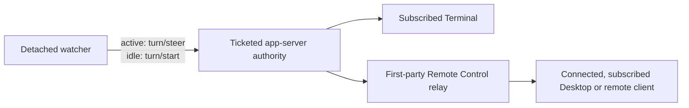

# codex-resume-after-wait

Hand a long process wait to a detached watcher, then continue the exact durable Codex task that
owns it. Protocol v3 injects automatically through a strongly fenced ancestor Unix listener, or
through a deliberately accepted weak endpoint that cannot prove backend-instance continuity.
Otherwise it leaves an explicit owner-bound marker.

It does not use goals, `codex exec resume`, or `thread/resume` for delivery. After native
acceptance, the ticketed app-server publishes its normal stream to first-party clients that are
currently connected and subscribed to the task.

## Install

```text
$skill-installer install https://github.com/zycccishere/codex-resume-after-wait/tree/main/skills/blocking-wait-handoff
```

Restart Codex after installation so the skill is rediscovered.

## Native continuation



The watcher reconnects only to the authority recorded at scheduling time and verifies that the
owner is still loaded. A strong ticket additionally proves the exact local Unix listener and live
app-server incarnation; a weak ticket proves only the selected endpoint descriptor and accepts
restart, endpoint-reuse, or proxy-backend ambiguity. It then reads the current task state:

### Delivery decision matrix

Actor routing and app-server attachment are separate decisions. `schedule` and `doctor` use the
same named `delivery_branch`; there is no implicit fallthrough between these rows.

| Verified actor route | Owner authority at scheduling | `auto` | Explicit `native-message` |
| --- | --- | --- | --- |
| No | Any | Reject | Reject |
| Yes | Private stdio or Embedded; no attachable endpoint | Marker | Reject |
| Yes | Attachable, but exact owner is not positively loaded | Marker | Reject |
| Yes | Loaded behind exact ancestor Unix listener + inode + live process | Strong native | Strong native |
| Yes | Loaded behind WS/WSS, alias, or non-ancestor endpoint | Marker | Reject unless `--allow-weak-authority`; then weak native |

Explicit `marker` is accepted only with a verified actor route. A marker never wakes an idle task.
The actor branch is independent: durable tasks and ordinary forks own themselves, nested
subagents route to their verified durable agent-tree root, and `/side` or incomplete ancestry is
rejected. Ordinary forks share the earliest verified fork-lineage job scope, so only the first
branch can reserve one logical job/process incarnation.

| Owner state | Submission | Positive acceptance evidence |
| --- | --- | --- |
| One regular turn is active | `turn/steer` with its exact `expectedTurnId` | Successful response for that exact turn |
| No turn is active on a positively loaded owner | `turn/start` | The matching `userMessage.clientId` appears in the owner's persisted history |
| Review/compact or a read/submit collision | No accepted input | Keep the same FIFO position and retry after the explicit rejection, bounded separately (900 one-second retries by default) |
| State is ambiguous | Nothing is guessed | Fail closed before submission |

The collision count is durable across watcher recovery. Override it with
`--state-collision-max-attempts`; use `0` only when an intentionally unlimited non-steerable wait
is acceptable. Exhaustion is a definitive pre-submission `BLOCKED`, so the job can be scheduled
again later without risking a duplicate accepted message.

Every submission carries a unique `clientUserMessageId`. It is acceptance evidence, not a
documented server-side idempotency key. Once request bytes may have crossed the transport boundary,
a timeout or disconnect becomes durable `UNKNOWN`; v3 never resends automatically.

History reads do not resume the task. Legacy threads use `thread/read(includeTurns=true)`;
paginated threads use experimental `thread/turns/list` because Codex rejects turns-included reads
for that history mode. The watcher deliberately never calls `thread/resume`, so it cannot cold-load
the same thread into a second authority.

### Idle-start side effect

The public idle API is `turn/start`. In the audited Codex implementation, that call copies the
calling connection's app-server `clientInfo` and form-elicitation capability into the loaded thread
before submitting input. The watcher identifies itself as the official secondary
`codex_app_server_daemon/2.0.0` client and does not change the app-server process-global
originator, but an idle wake still replaces the thread's prior client name/version, sets OpenAI-form
elicitation support to `false`, and may refresh MCP state. It does not subscribe the watcher to
thread events. The active `turn/steer` path does not perform that update. There is no public neutral
idle-enqueue API for the skill to use instead.

## Quick start

Check routing and the authority first:

```bash
python3 skills/blocking-wait-handoff/scripts/codex_wait_handoff.py active \
  --include-stale --json

python3 skills/blocking-wait-handoff/scripts/codex_wait_handoff.py doctor --json
```

Schedule an already-running local PID:

```bash
python3 skills/blocking-wait-handoff/scripts/codex_wait_handoff.py schedule \
  --blocking \
  --expected-seconds 1800 \
  --pid 12345 \
  --note "Inspect the outputs and continue the blocked task."
```

When the current shell descends from an attachable app-server listener, the script uses that exact
ancestor endpoint. Otherwise it uses the managed daemon socket under
`$CODEX_HOME/app-server-control/app-server-control.sock` only for persisted routing diagnostics;
that socket never becomes the owner of a private Desktop/IDE or Embedded task. For a TUI using an
explicit remote app-server, supply the exact same client connect endpoint if discovery cannot
recover it reliably:

```bash
export CODEX_WAIT_REMOTE_TOKEN='<bearer token>'

python3 skills/blocking-wait-handoff/scripts/codex_wait_handoff.py schedule \
  --blocking \
  --expected-seconds 1800 \
  --pid 12345 \
  --app-server-endpoint 'wss://example.test:443/' \
  --app-server-auth-token-env CODEX_WAIT_REMOTE_TOKEN \
  --allow-weak-authority
```

Only the token environment-variable name is persisted. Keep that variable available to the
detached watcher. The audited app-server listener binds plain `ws://`; a TUI may instead use a
`wss://` connect endpoint when a private TLS proxy terminates TLS and forwards to that listener.
The ticket retains both the listener and connect endpoints, and any alias is always weak because
there is no public per-app-server-instance nonce. Prefer authenticated TLS on a private network,
VPN/mesh, or SSH tunnel, and do not expose the app-server directly to the public Internet. The
explicit flag permits native injection but accepts endpoint reuse, daemon restart, and proxy
backend-change risk. Without it, `auto` leaves a marker and explicit `native-message` fails.

Read the schedule result and its linked task record before ending the current turn:

- `task_id`, `event_id`, and `client_user_message_id`;
- `actor_thread_id`, `owner_thread_id`, and `owner_route`;
- `job_scope_id`, `logical_job_id`, and `job_key`;
- `resume_protocol`, `delivery_branch`, `authority`, `authority_strength`, and `fifo_generation`; and
- `will_wake_idle_thread`, `native_at_most_once`, and `strict_exactly_once`.

Only `resume_protocol=native-message` can wake an idle task. `marker` requires a later owner-side
claim and input.

## Process-incarnation fencing

A PID is only a reusable namespace slot. Before preflight and before detaching, v3 captures the
exact process incarnation and persists it. Polling and `--also-stop-target` use only that stored
identity; a pattern is never rerun later to discover new targets.

| Target host | Strong start identity | Exit wait | Strict scheduling |
| --- | --- | --- | --- |
| Local Linux | boot ID + `/proc/<pid>/stat` start ticks | `pidfd` when available, otherwise polling | Yes |
| Remote Linux | remote boot ID + `/proc` start ticks | Polling over SSH | Yes |
| Local macOS | microsecond start time from `libproc` | `kqueue NOTE_EXIT` when available, otherwise polling | Yes |
| Remote macOS or generic Unix | second-resolution `ps lstart` only | Polling | Rejected as too weak |

`--pattern` snapshots every matching non-zombie incarnation after excluding the helper and its
ancestor chain. The remote pattern travels over helper stdin, not an SSH or shell argv that
`pgrep -f` could match. A pattern with several matches waits for all captured incarnations; later
matches are outside the job.

Signal safety has a platform boundary. Linux local termination uses a pidfd when Python exposes
both open and send operations. macOS, remote shells, and Linux without that handle can only
revalidate immediately before `kill`; POSIX exposes an unavoidable check-to-signal TOCTOU window.
Inspection uncertainty always fails closed, and every already-detected PID replacement is left
untouched.

## Jobs, forks, and deduplication

Delivery ownership and duplicate-job scope are different:

- A durable top-level task or ordinary fork owns messages scheduled from itself.
- A wait scheduled before a fork stays bound to the original branch.
- All ordinary forks in one `forkedFromId` lineage share a common job registry. For the same
  logical job and process incarnation, the first branch that reserves wins; sibling branches
  cannot create a second wake.
- A nested subagent routes through every verified `parentThreadId` to its durable agent-tree root.
  If that root is an ordinary fork, that fork owns delivery while the common registry still uses
  the original fork-lineage scope.
- Direct subagent resume-self and `/side` scheduling are rejected. Current persisted side metadata
  cannot prove a durable parent destination.

The default logical ID is `process-lifetime`. A common-registry `ACCEPTED` entry is a permanent
tombstone for that job key across branches and across native/marker protocols. `ACTIVE` and
`UNKNOWN` also deduplicate; `BLOCKED` and `CANCELLED` permit a retry. To monitor the same live
incarnation for an intentional later cycle, provide a new explicit value:

```bash
python3 skills/blocking-wait-handoff/scripts/codex_wait_handoff.py schedule \
  --blocking --expected-seconds 1800 --pid 12345 \
  --job-id evaluation-cycle-2
```

Reusing the same explicit `--job-id` reuses the tombstone. A genuinely new process incarnation
gets a different job key automatically.

## Two delivery ledgers

Native and marker events intentionally use separate ready-order FIFO ledgers:

```text
native: owner_thread_id
marker: marker:<owner_thread_id>
common duplicate fence: fork-lineage job_scope_id
```

Each protocol serializes its own events by the order they become `READY`; scheduling order is not
completion order. Because there is no cross-protocol FIFO, the common registry also applies an
exact-owner protocol gate: one `delivery_owner_id` may not have unresolved native and marker events
at the same time. `ACTIVE` or `UNKNOWN` in one protocol blocks registration in the other until the
event reaches `ACCEPTED`, `BLOCKED`, or `CANCELLED`; an unreconciled `UNKNOWN` keeps the gate shut.
Distinct ordinary-fork owners do not share this gate. Independently, the registry prevents the same
logical job from registering once in each protocol anywhere in the fork lineage.

```text
SCHEDULED -> WATCHING -> READY -> SUBMITTING -> ACCEPTED
                                      |
                                      +-> READY      explicit non-acceptance only
                                      +-> BLOCKED    definitive terminal rejection
                                      +-> UNKNOWN    possible delivery; never replay
```

`SUBMITTING` and `UNKNOWN` block later entries in that same ledger. `UNKNOWN -> ACCEPTED` is legal
only after positive history reconciliation.

## Marker fallback

`auto` selects native delivery only for a verified owner already loaded behind a `strong`
authority. Strong means an exact ancestor Unix listener with both a connected socket device/inode
fingerprint and a live, strong app-server process incarnation. Explicit/configured endpoints with
no ancestor proof and all WS/WSS endpoints are `weak`; use `--allow-weak-authority` only to accept
that hard boundary. The acceptance is stored inside the ordered ledger's authority descriptor, so
a READY watcher and reconciler use the rebound policy rather than a stale task-file mirror. A
client-facing endpoint that differs from the ancestor listener (for example,
an ancestor `ws://` bind behind a `wss://` alias) remains attachable for probing but records both
endpoints and is always weak; the same rule prevents a mismatched Unix socket from becoming strong.
Terminal Embedded and private Desktop/IDE stdio owners stay marker-only even with the weak opt-in
because they expose no second-client endpoint.

```bash
python3 skills/blocking-wait-handoff/scripts/codex_wait_handoff.py pending \
  --owner-thread-id "$CODEX_THREAD_ID" --json

python3 skills/blocking-wait-handoff/scripts/codex_wait_handoff.py claim \
  --task-id <task-id> \
  --owner-thread-id "$CODEX_THREAD_ID" --json
```

Claiming is branch-bound and single-consumer, but stdout and subsequent Codex/model input are not
one transaction. The implementation flushes the prompt before committing marker `ACCEPTED`; a
crash in that gap is fenced `UNKNOWN` and never replays. Even `ACCEPTED` proves only that claim
output was emitted, not that it became model input. This repository does not implement a Desktop
heartbeat. A separately configured first-party automation targeted to this exact task may poll and
claim, but remains periodic polling and does not turn marker delivery into a native wake.

## Surface compatibility

| Topology | Delivery | Live visibility |
| --- | --- | --- |
| Managed daemon through its exact ancestor Unix listener | Strong native | Current first-party task subscribers receive the normal owner stream |
| Explicit/configured Unix endpoint without ancestor provenance | Marker by default; weak native only with explicit opt-in | Conditional on a currently connected and subscribed first-party client |
| Explicit remote WebSocket or a `wss://` connect alias for a `ws://` listener | Marker by default; weak native only with credential reference and `--allow-weak-authority`; no backend-instance fence | Conditional on a currently connected and subscribed first-party client |
| Desktop or another Remote Control client controlling the Terminal host | Subscriber surface, not a distinct delivery authority | Streams only while connected and subscribed to the task |
| Desktop SSH remote project using `app-server --listen unix://` plus `app-server proxy` | Strong native when the watcher runs on that remote host and proves the exact ancestor socket, inode, and process incarnation | Desktop receives the normal stream through its existing SSH proxy |
| Older/custom Desktop SSH topology whose remote owner exposes only private stdio | Marker only | No supported watcher attachment to that private topology |
| Terminal Embedded | Marker only | No external attachment endpoint |
| Desktop or IDE private stdio | Marker only | The private pipes are not a supported second-client endpoint |

The same persisted `thread_id` loaded in another app-server is not the same authority. TLS,
endpoint identity, and Remote Control installation/environment IDs do not identify one app-server
process and can survive a restart or proxy backend change. Strict network fencing requires a
future server-issued per-boot instance ID plus an atomic submission precondition.
The watcher does not subscribe itself to the owner stream. Live visibility requires a first-party
client that is currently connected and subscribed to this task; Remote Control additionally
requires the host to remain awake and online, the account signed in, and the host app running. If
those conditions are absent, no live stream is promised. Accepted input and output remain in
persisted task history, and an approval may remain pending until a first-party client later resumes
and subscribes.

The audited Desktop SSH implementation starts a Unix-listening app-server on the SSH host and
connects Desktop through `codex app-server proxy`. A watcher launched by that remote task runs on
the same host and can therefore attach to the same Unix socket. This is different from local
Desktop project and projectless tasks, whose owner is still the app's private stdio app-server.

## Cancellation, recovery, and handoff

Three P0 fences are mandatory:

1. cancellation cannot cross `SUBMITTING` or an ambiguous result;
2. schedule does not succeed until the guarded watcher has durably entered `WATCHING`, stored its
   own strong process incarnation, and returned a matching startup ACK; and
3. the hidden `watch` command can enter only from `scheduled`/`watching`, never from a post-event
   or terminal phase.

`cancel` and `stop` signal only the persisted watcher incarnation. Missing, malformed, weak, or
unprobeable identity retains the reservation. `stop --also-stop-target` touches the captured target
only after ledger cancellation commits.

Use `recover --task-id ...` for a crashed staged/ready watcher. An interrupted `SUBMITTING` becomes
`UNKNOWN`. Use `reconcile --task-id ...` only for native `UNKNOWN`; absence of the client ID from
history is inconclusive.

`freeze`/`rebind` is only a ledger-level authority switch within one unchanged coordination store.
Every watcher, command, and authority must continue using the same underlying task files, ledger,
job registry, and stable lock files/inodes; equal path strings or copied files are not sufficient.
Never copy or move live state as a migration protocol. Run `freeze` from the exact owner, keep the
ledger `DRAINING`, verify the replacement attachable authority from that same lock domain, then
run `rebind` with the expected authority epoch. `SUBMITTING` or `UNKNOWN` prevents the switch.
Rebind atomically updates pending ledger entries; it does not move watchers or credentials, retire
an old app-server, integrate Codex product handoff, or provide strict cross-host migration. If the
same coordination and lock store is unavailable, keep delivery frozen and report the switch as
blocked.

## Guarantees and limits

Protocol v3 guarantees durable local fencing and at most one automatically possibly-accepted
submission per event. It does not guarantee strict exactly-once delivery, model execution, shell
effects, or cross-host migration. Ordinary user messages are ordered by their actual arrival at the
owning app-server, not by a global queue controlled by this skill.

See [protocol v3](skills/blocking-wait-handoff/references/protocol-v3.md), the
[Codex source audit](skills/blocking-wait-handoff/references/source-audit.md), and the
[P0 race audit](skills/blocking-wait-handoff/references/race-fencing.md). These canonical references
ship with GitHub subdirectory installs. Official background is available in
[Codex App Server](https://learn.chatgpt.com/docs/app-server) and
[Remote connections](https://learn.chatgpt.com/docs/remote-connections).

## Validation

```bash
python3 -m unittest discover -s tests -v
python3 -m py_compile skills/blocking-wait-handoff/scripts/*.py
python3 ~/.codex/skills/.system/skill-creator/scripts/quick_validate.py \
  skills/blocking-wait-handoff
```
